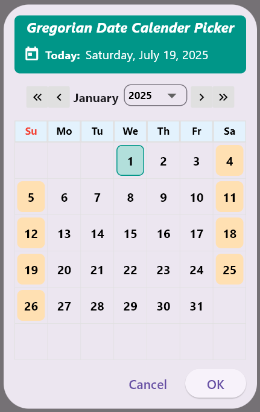
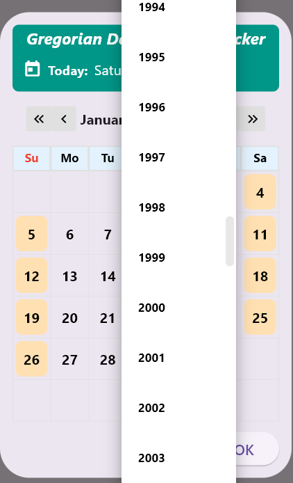
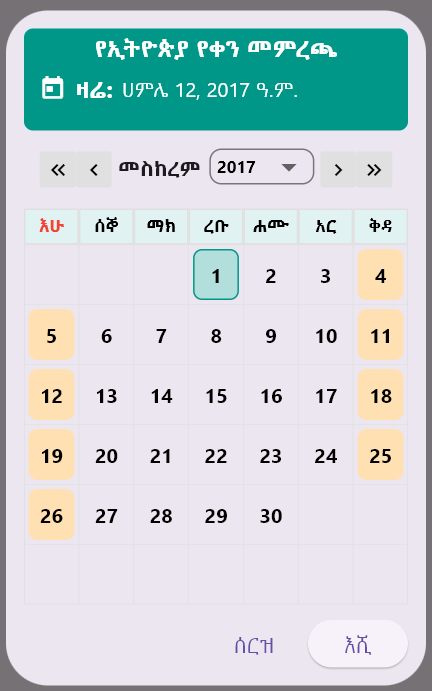
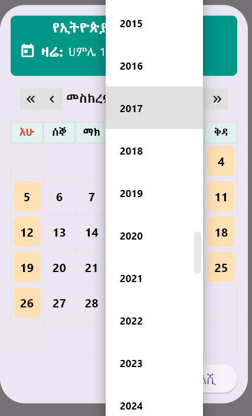
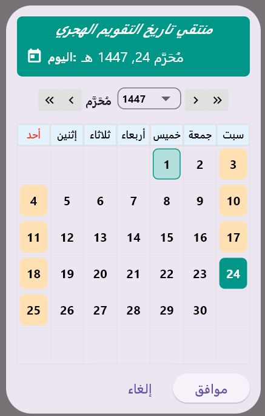
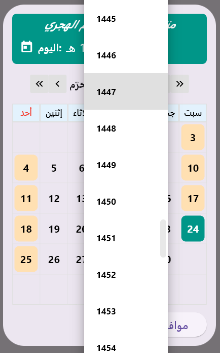

# calendar_picker_ghe

A lightweight, customizable Flutter date picker supporting:

- 🗓️ **Gregorian Calendar**
- 🌙 **Hijri (Islamic) Calendar**
- 🗿 **Ethiopian Calendar**

Choose any calendar with a **unified API** and a beautiful, fully custom dialog.

---

## ✨ Features

- 🔁 Easy month/year navigation via dropdowns and arrows
- ✅ Today’s date and selected date are clearly highlighted
- 📆 Configurable year range (`firstYear`, `lastYear`) and default year (`initialYear`)
- 🎯 One method to rule them all: `showUnifiedDatePicker(...)`
- 🌍 Clean, extensible codebase for custom calendar integrations

---

## 📸 Screenshots

### 📅 Gregorian Calendar

| Table View | Year Dropdown |
|------------|----------------|
|  |  |

### 🗿 Ethiopian Calendar

| Table View | Year Dropdown |
|------------|----------------|
|  |  |

### 🌙 Hijri Calendar

| Table View | Year Dropdown |
|------------|----------------|
|  |  |

---

## 🚀 Getting Started

### 📦 Installation

Run this command:

With Flutter (open flutter teminal and run):

```bash
 flutter pub add calendar_picker_ghe
 ```

This will add a line like this to your package's pubspec.yaml (and run an implicit flutter pub get):


```yaml
dependencies:
  calendar_picker_ghe: 1.0.0
```
Import it

Now in your Dart code, you can use:
```dart
import 'package:calendar_picker_ghe/calendar_picker.dart';
```
Or,

Add the package to your `pubspec.yaml`: and run Pub get

```yaml
dependencies:
  calendar_picker_ghe: 1.0.0 
```    
## 🧪 Usage

```dart
import 'package:calendar_picker_ghe/calendar_picker.dart';

final pickedDate = await showUnifiedDatePicker(
  context: context,
  calendarType: CalendarType.ethiopian, // or CalendarType.hijri / .gregorian
  initialYear: 2015,
  firstYear: 2000,
  lastYear: 2030,
);
```
Here the showUnifiedDatePicker method expects you to select calenderType which can be
ethiopian, hijri or gregorian according to your choice. And the other variables are
initialYear, firstYear and lastYear which corresponds to range of year you want to see
and the initial of when dropdown is shown. you can select, forexample, the initialYear
to be today's year which can be done by setting
```dart
initialYear: DateTime.now(), // for gregorian choice 
```
For ethiopian and hijri calender choice you can access todays year through
calendar_converter.dart as follows
```dart
initialYear: Hijri.now(), // for hijri choice and

initialYear: Ethiopian.now(), // for ethiopian calendar choice
```
## 📝 License
This project is licensed under the MIT License.

## 📬 Contact
For questions, feedback, or contributions:

       📧 Email: halidawell00@gmail.com
