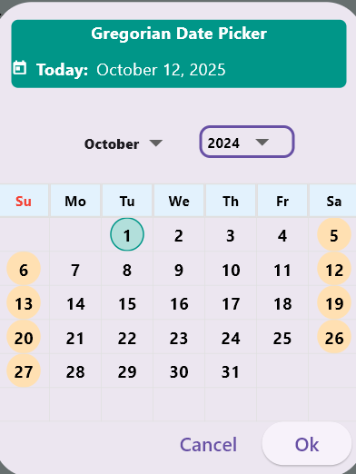
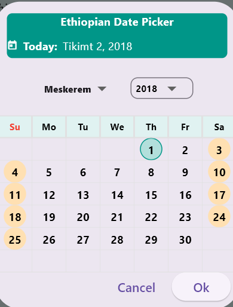
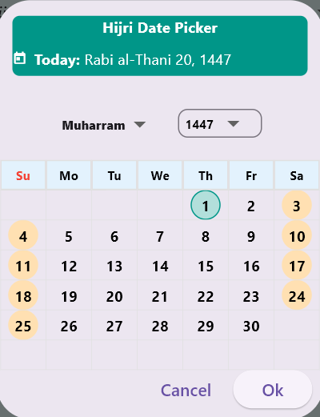
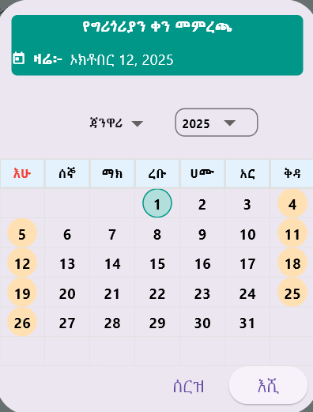
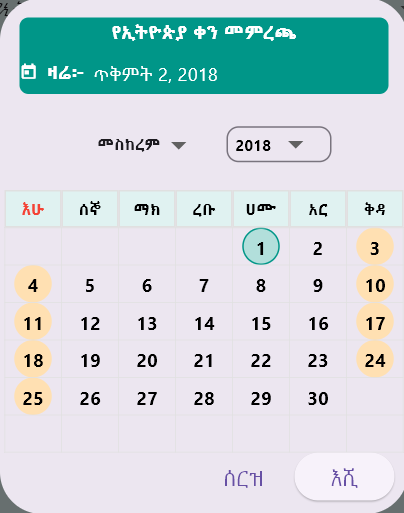
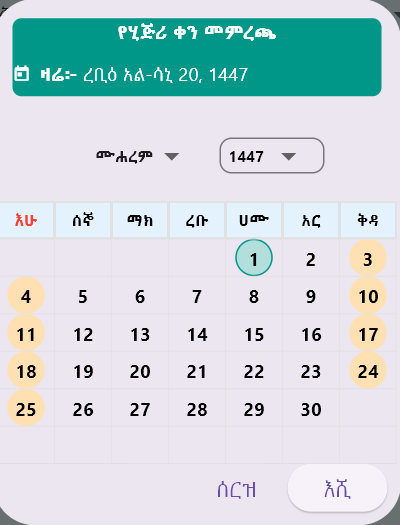
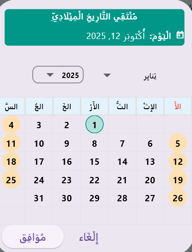
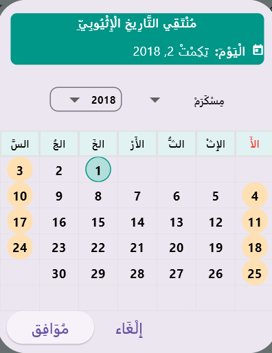
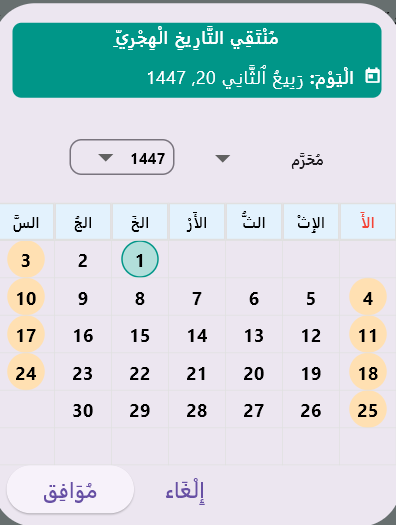

# calendar_picker_ghe

A lightweight, customizable Flutter date picker supporting:

- 🗓️ **Gregorian Calendar**
- 🕌 **Hijri Calendar**
- 🌍 **Ethiopian Calendar**

Easily switch between calendars using a **unified API** with a clean, customizable dialog interface.

---

## ✨ Features

- 🔁 Easy month/year navigation via dropdowns and arrows
- ✅ Highlights for today’s date and selected date
- 📆 Configurable year range: `firstYear`, `lastYear`, and `initialYear`
- 🌐 Multilingual support: English (default), Amharic, Arabic
- 🎯 Unified function: `showUnifiedDatePicker(...)`
- 🌍 Clean, extensible codebase for integrating other calendars
- 📱 Responsive for small and large screens

---

## 📸 Screenshots

### 🇬🇧 English

| Gregorian                                                | Ethiopian                                               | Hijri                                                 |
|----------------------------------------------------------|---------------------------------------------------------|-------------------------------------------------------|
|  |  |  |

---

### 🇪🇹 Amharic

| Gregorian                                                | Ethiopian                                               | Hijri                                                 |
|----------------------------------------------------------|---------------------------------------------------------|-------------------------------------------------------|
|  |  |  |

---

### 🇸🇦 Arabic

| Gregorian                                               | Ethiopian                                              | Hijri                                                |
|---------------------------------------------------------|--------------------------------------------------------|------------------------------------------------------|
|  |  |  |

---

## 🚀 Getting Started

### 📦 Installation

Run this command in your Flutter terminal:

```bash
flutter pub add calendar_picker_ghe
```
This will add the following line to your pubspec.yaml and fetch the package:

```yaml
dependencies:
calendar_picker_ghe: ^2.2.0
```
### 📥 Import the Package

```dart
import 'package:calendar_picker_ghe/calendar_picker.dart';
```
### 🧪 Usage

<pre lang="markdown"> 
final pickedDate = await showUnifiedDatePicker(
context: context,
calendarType: CalendarType.ethiopian, // or .hijri / .gregorian
initialYear: 2015,
firstYear: 2000,
lastYear: 2030,
);
</pre>

### 🧭 Full Function Signature

``` dart
Future<dynamic> showUnifiedDatePicker({
  required BuildContext context,
  required CalendarType calendarType,
  required int initialYear,
  required int firstYear,
  required int lastYear,
  String locale = 'en', // Optional: 'en', 'am', or 'ar'
});

```
### 📘 Field Descriptions

| Parameter      | Type           | Required | Default | Description                                                       |
|----------------|----------------|----------|---------|-------------------------------------------------------------------|
| `context`      | `BuildContext` | ✅ Yes    | –       | The build context from which the date picker will be shown.       |
| `calendarType` | `CalendarType` | ✅ Yes    | –       | The calendar system to use: `gregorian`, `ethiopian`, or `hijri`. |
| `initialYear`  | `int`          | ✅ Yes    | –       | The year that will be initially displayed when the picker opens.  |
| `firstYear`    | `int`          | ✅ Yes    | –       | The earliest year a user can navigate to and select.              |
| `lastYear`     | `int`          | ✅ Yes    | –       | The latest year a user can navigate to and select.                |
| `locale`       | `String`       | ❌ No     | `'en'`  | Language: `'en'` (English), `'am'` (Amharic), or `'ar'` (Arabic)  |

### 🌐 Locale Options
By default, the date picker uses English. Use the locale parameter to switch language:

| Locale | Language          |
|--------|-------------------|
| `'en'` | English (default) |
| `'am'` | Amharic           |
| `'ar'` | Arabic            |

### ✅ Usage Examples (All 9 Possibilities)

<pre lang="markdown">
// Gregorian - English (default)
await showUnifiedDatePicker(
  context: context,
  calendarType: CalendarType.gregorian,
  initialYear: DateTime.now().year,
  firstYear: 1900,
  lastYear: 2100,
);

// Gregorian - Amharic
await showUnifiedDatePicker(
  context: context,
  calendarType: CalendarType.gregorian,
  initialYear: DateTime.now().year,
  firstYear: 1900,
  lastYear: 2100,
  locale: 'am',
);

// Gregorian - Arabic
await showUnifiedDatePicker(
  context: context,
  calendarType: CalendarType.gregorian,
  initialYear: DateTime.now().year,
  firstYear: 1900,
  lastYear: 2100,
  locale: 'ar',
);

// Ethiopian - English
await showUnifiedDatePicker(
  context: context,
  calendarType: CalendarType.ethiopian,
  initialYear: Ethiopian.now().year,
  firstYear: 1900,
  lastYear: 2100,
);

// Ethiopian - Amharic
await showUnifiedDatePicker(
  context: context,
  calendarType: CalendarType.ethiopian,
  initialYear: Ethiopian.now().year,
  firstYear: 1900,
  lastYear: 2100,
  locale: 'am',
);

// Ethiopian - Arabic
await showUnifiedDatePicker(
  context: context,
  calendarType: CalendarType.ethiopian,
  initialYear: Ethiopian.now().year,
  firstYear: 1900,
  lastYear: 2100,
  locale: 'ar',
);

// Hijri - English
await showUnifiedDatePicker(
  context: context,
  calendarType: CalendarType.hijri,
  initialYear: Hijri.now().year,
  firstYear: 1358,
  lastYear: 1500,
);

// Hijri - Amharic
await showUnifiedDatePicker(
  context: context,
  calendarType: CalendarType.hijri,
  initialYear: Hijri.now().year,
  firstYear: 1358,
  lastYear: 1500,
  locale: 'am',
);

// Hijri - Arabic
await showUnifiedDatePicker(
  context: context,
  calendarType: CalendarType.hijri,
  initialYear: Hijri.now().year,
  firstYear: 1358,
  lastYear: 1500,
  locale: 'ar',
);

</pre>

### 📘 Notes
To set the initial year dynamically:

<pre lang="markdown">

initialYear: DateTime.now().year, // Gregorian
initialYear: Hijri.now().year,    // Hijri (requires Hijri converter)
initialYear: Ethiopian.now().year, // Ethiopian (requires Ethiopian converter)

</pre>

### 📝 License
This project is licensed under the terms of the [Apache License 2.0](LICENSE).

### 📬 Contact
For questions, feedback, or contributions:

📧 Email: halidawell00@gmail.com