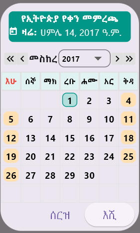
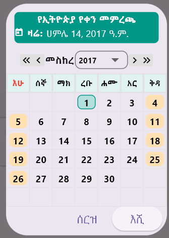
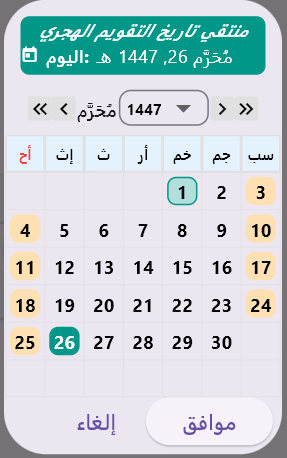
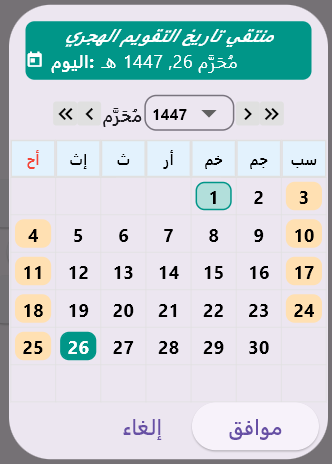

# calendar_picker_ghe

A lightweight, customizable Flutter date picker supporting:

- 🗓️ **Gregorian Calendar**
- 🌙 **Hijri (Islamic) Calendar**
- 🗿 **Ethiopian Calendar**

Easily switch between calendars using a **unified API** with a clean, customizable dialog interface.

---

## ✨ Features

- 🔁 Easy month/year navigation via dropdowns and arrows
- ✅ Highlights for today’s date and selected date
- 📆 Configurable year range: `firstYear`, `lastYear`, and `initialYear`
- 🎯 Unified function: `showUnifiedDatePicker(...)`
- 🌍 Clean, extensible codebase for integrating other calendars
- Responsive for small devices
---

## 📸 Screenshots

### 📅 Gregorian Calendar

| On Small Screen                                      | On Big Screen                                     |
|------------------------------------------------------|---------------------------------------------------|
|  |  |

### 🗿 Ethiopian Calendar

| On Small Screen                                     | On Big Screen                                    |
|-----------------------------------------------------|--------------------------------------------------|
|  |  |

### 🌙 Hijri Calendar

| On Small Screen                                   | On Big Screen                                  |
|---------------------------------------------------|------------------------------------------------|
|  |  |

---

## 🚀 Getting Started

### 📦 Installation

Run this command in your Flutter terminal:

```bash
flutter pub add calendar_picker_ghe
```
This will add the following line to your pubspec.yaml and fetch the package:

```yaml
dependencies:
calendar_picker_ghe: ^1.0.0
```
### 📥 Import the Package
In your Dart file:

```
import 'package:calendar_picker_ghe/calendar_picker.dart';
```
Alternatively, add the dependency manually in pubspec.yaml and run flutter pub get.

### 🧪 Usage
<pre lang="markdown"> 

import 'package:calendar_picker_ghe/calendar_picker.dart';

final pickedDate = await showUnifiedDatePicker(
  context: context,
  calendarType: CalendarType.ethiopian, // or CalendarType.hijri / .gregorian
  initialYear: 2015,
  firstYear: 2000,
  lastYear: 2030,
);

</pre>
The calendarType can be one of: CalendarType.gregorian, CalendarType.hijri, or CalendarType.ethiopian.

initialYear, firstYear, and lastYear define the visible year range and default year in the dropdown.

To set the initialYear to today’s year:

<pre lang="markdown"> 

initialYear: DateTime.now().year, // Gregorian calendar

</pre>
For Hijri and Ethiopian calendars, use:
<pre lang="markdown"> 

initialYear: Hijri.now().year,     // Hijri calendar
initialYear: Ethiopian.now().year, // Ethiopian calendar

</pre>
(Requires appropriate date converter utilities from calendar_converter.dart)

### 📝 License
This project is licensed under the MIT License.

### 📬 Contact
For questions, feedback, or contributions:

### 📧 Email: halidawell00@gmail.com
